---
## Front matter
lang: ru-RU
title: Дискреционное разграничение прав в Linux. Основные атрибуты
author: Назарьева Алена НФИбд-03-18
institute:
	inst{1}RUDN University, Moscow, Russian Federation
date: 2021, 1 october
## Formatting
toc: false
slide_level: 2
theme: metropolis
mainfont: PT Serif
romanfont: PT Serif
sansfont: PT Sans
monofont: PT Mono
mainfontoptions: Ligatures=TeX
romanfontoptions: Ligatures=TeX
sansfontoptions: Ligatures=TeX,Scale=MatchLowercase
monofontoptions: Scale=MatchLowercase
header-includes:
 - \metroset{progressbar=frametitle,sectionpage=progressbar,numbering=fraction}
 - '\makeatletter'
 - '\beamer@ignorenonframefalse'
 - '\makeatother'
aspectratio: 43
section-titles: true
---
# Цель работы

Получение практических навыков работы в консоли с атрибутами файлов, закрепление теоретических основ дискреционного разграничения доступа в современных системах с открытым кодом на базе ОС Linux.

# Выполнение лабораторной работы

## 1)
В установленной при выполнении предыдущей лабораторной работы
операционной системе создала учётную запись пользователя guest,
задала пароль для пользователя guest (рис. -@fig:001)

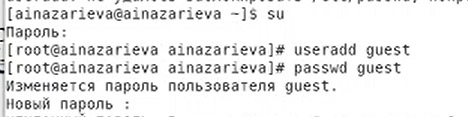{ #fig:001 width=70% }
## 2)
Вошла в систему от имени пользователя guest. Определила директорию,
в которой вы находитесь, командой pwd. Сравнила
её с приглашением командной строки. Она является моей домашней директорией. (рис. -@fig:002)

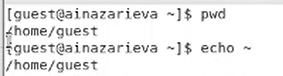{ #fig:002 width=70% }
## 3)
Уточнила имя моего пользователя командой whoami:guest.
Уточнила имя моего пользователя, его группу, а также группы, куда вхо-
дит пользователь, командой id. Выведенные значения uid, gid и др.
запомнила. Сравнила вывод id с выводом команды groups.
Сравнила полученную информацию об имени пользователя с данными,
выводимыми в приглашении командной строки.  (рис. -@fig:003)

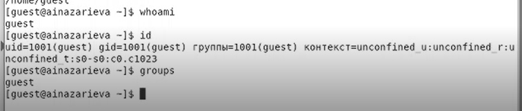{ #fig:003 width=70% }
## 4)
Просмотрела файл /etc/passwd командой
cat /etc/passwd| grep guest
Нашла в нём свою учётную запись. Определила uid пользователя.
Определила gid пользователя. Сравнила найденные значения с получен-
ными в предыдущих пунктах: они совпадают.  (рис. -@fig:004)

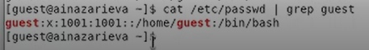{ #fig:004 width=70% }

## 5)
Определила существующие в системе директории командой
ls -l /home/
Мне удалось получить список поддиректорий директории /home. Установленные права-drwx------
(рис. -@fig:005)

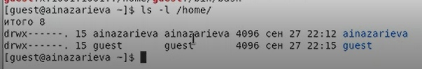{ #fig:005 width=70% }
## 6)
Проверила, какие расширенные атрибуты установлены на поддиректориях,
находящихся в директории /home, командой:
lsattr /home
Мне не удалось увидеть расширенные атрибуты директории. (рис. -@fig:006)

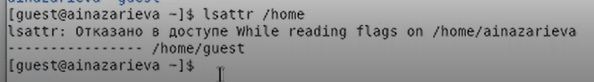{ #fig:006 width=70% }

## 7)
Создала в домашней директории поддиректорию dir1 командой
mkdir dir1
Определила командами ls -l и lsattr, какие права доступа и расширенные
атрибуты были выставлены на директорию dir1: 000 000.
Сняла с директории dir1 все атрибуты командой chmod 000 dir1
и проверила с её помощью правильность выполнения команды
ls -l (рис. -@fig:007)

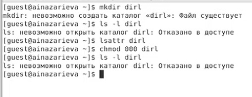{ #fig:007 width=70% }
## 8)
Попыталась создать в директории dir1 файл file1 командой
echo "test" > /home/guest/dir1/file1
Я получила отказ в выполнении операции по созданию
 файла, т.к. права на директорию не ссоответсвуют
Проверьте командой
ls -l /home/guest/dir1
, что действительно файл file1 не находится внутри директории dir1.
## 9)

Заполнила таблицу «Установленные права и разрешённые действия»,
выполняя действия от имени владельца директории (файлов),
определив опытным путём, какие операции разрешены, а какие нет.
Если операция разрешена, занесла в таблицу знак «+», если не разре-
шена, знак «-». (рис. -@fig:008)

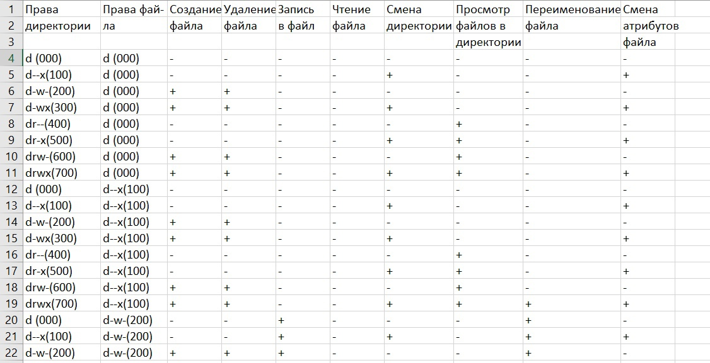{ #fig:008 width=70% }
## 10)
(рис. -@fig:009)

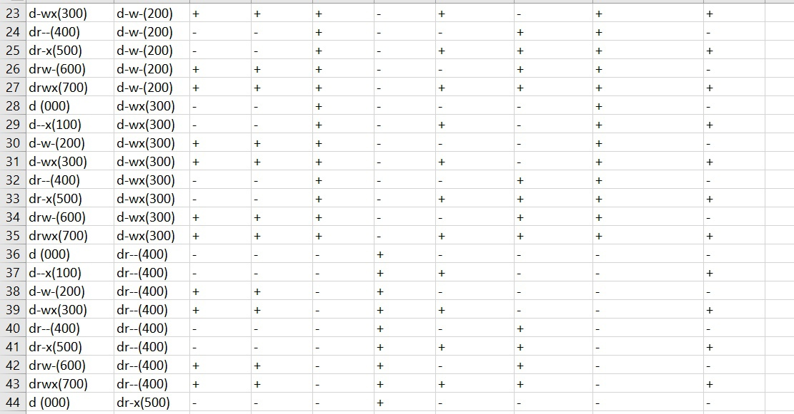{ #fig:009 width=70% }
## 11)
(рис. -@fig:010)

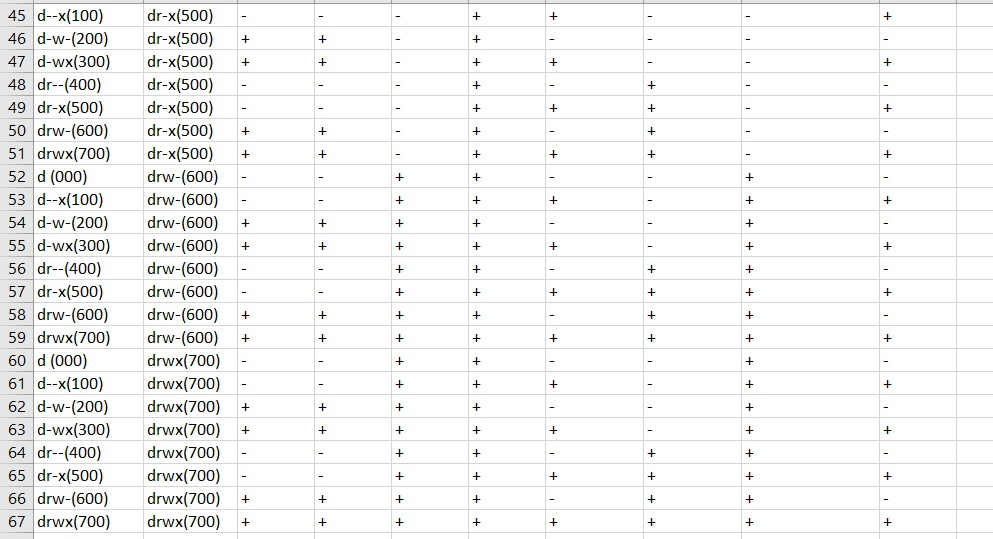{ #fig:010 width=70% }
## 12)
На основании заполненной таблицы определила те или иные минимально
необходимые права для выполнения операций внутри директории
dir1, заполнила таблицу. (рис. -@fig:011)

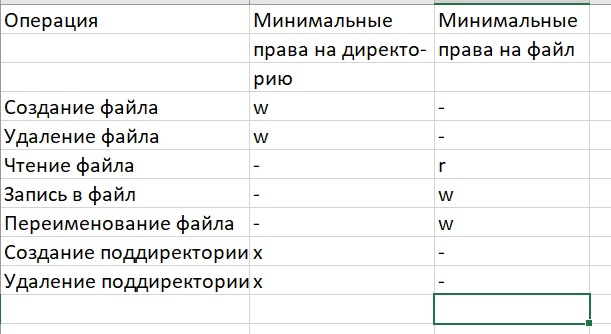{ #fig:011 width=70% }

# Выводы

В результате проделанной работы я Получила практические навыки работы в консоли с атрибутами файлов, закрепила теоретические основы дискреционного разграничения доступа в современных системах с открытым кодом на базе ОС Linux.
