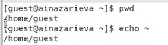
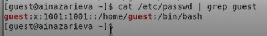
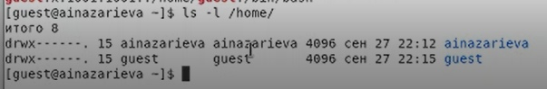
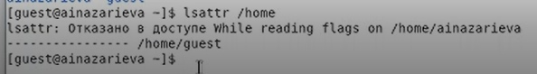
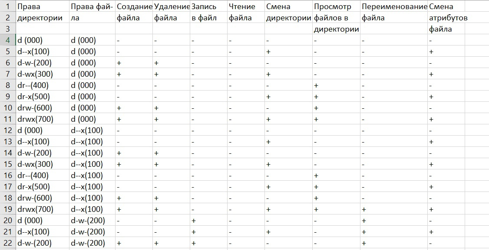
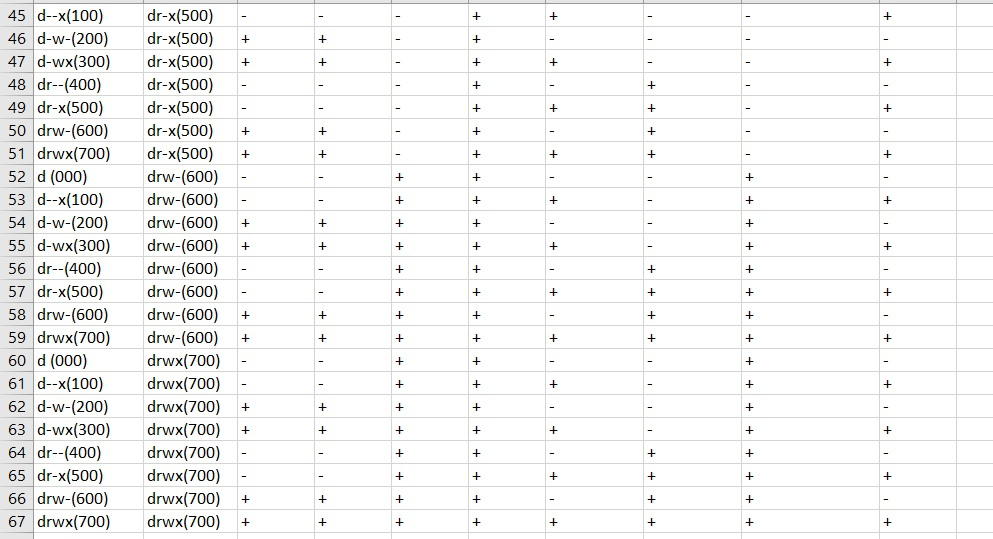

---
# Front matter
lang: ru-RU
title: "Oтчёт по лабораторной работе"
subtitle: "Дискреционное разграничение прав в Linux. Основные атрибуты"
author: "Назарьева Алена Игоревна НФИбд-03-18"

# Formatting
toc-title: "Содержание"
toc: true # Table of contents
toc_depth: 2
lof: true # List of figures
lot: true # List of tables
fontsize: 12pt
linestretch: 1.5
papersize: a4paper
documentclass: scrreprt
polyglossia-lang: russian
polyglossia-otherlangs: english
mainfont: PT Serif
romanfont: PT Serif
sansfont: PT Sans
monofont: PT Mono
mainfontoptions: Ligatures=TeX
romanfontoptions: Ligatures=TeX
sansfontoptions: Ligatures=TeX,Scale=MatchLowercase
monofontoptions: Scale=MatchLowercase
indent: true
pdf-engine: lualatex
header-includes:
  - \linepenalty=10 # the penalty added to the badness of each line within a paragraph (no associated penalty node) Increasing the value makes tex try to have fewer lines in the paragraph.
  - \interlinepenalty=0 # value of the penalty (node) added after each line of a paragraph.
  - \hyphenpenalty=50 # the penalty for line breaking at an automatically inserted hyphen
  - \exhyphenpenalty=50 # the penalty for line breaking at an explicit hyphen
  - \binoppenalty=700 # the penalty for breaking a line at a binary operator
  - \relpenalty=500 # the penalty for breaking a line at a relation
  - \clubpenalty=150 # extra penalty for breaking after first line of a paragraph
  - \widowpenalty=150 # extra penalty for breaking before last line of a paragraph
  - \displaywidowpenalty=50 # extra penalty for breaking before last line before a display math
  - \brokenpenalty=100 # extra penalty for page breaking after a hyphenated line
  - \predisplaypenalty=10000 # penalty for breaking before a display
  - \postdisplaypenalty=0 # penalty for breaking after a display
  - \floatingpenalty = 20000 # penalty for splitting an insertion (can only be split footnote in standard LaTeX)
  - \raggedbottom # or \flushbottom
  - \usepackage{float} # keep figures where there are in the text
  - \floatplacement{figure}{H} # keep figures where there are in the text
---

# Цель работы

Получение практических навыков работы в консоли с атрибутами файлов, закрепление теоретических основ дискреционного разграничения доступа в современных системах с открытым кодом на базе ОС Linux.

# Выполнение лабораторной работы

1. В установленной при выполнении предыдущей лабораторной работы
операционной системе создала учётную запись пользователя guest
(использую учётную запись администратора):
useradd guest

2. Задала пароль для пользователя guest (использую учётную
   запись администратора):
passwd guest (рис. -@fig:001)

{ #fig:001 width=70% }

3. Вошла в систему от имени пользователя guest.
4. Определила директорию, в которой вы находитесь, командой pwd. Сравнила
её с приглашением командной строки. Она является моей домашней директорией. (рис. -@fig:002)

{ #fig:002 width=70% }

5. Уточнила имя моего пользователя командой whoami:guest.
6. Уточнила имя моего пользователя, его группу, а также группы, куда вхо-
дит пользователь, командой id. Выведенные значения uid, gid и др.
запомнила. Сравнила вывод id с выводом команды groups.
7. Сравнила полученную информацию об имени пользователя с данными,
выводимыми в приглашении командной строки.  (рис. -@fig:003)

{ #fig:003 width=70% }

8. Просмотрела файл /etc/passwd командой
cat /etc/passwd| grep guest
Нашла в нём свою учётную запись. Определила uid пользователя.
Определила gid пользователя. Сравнила найденные значения с получен-
ными в предыдущих пунктах: они совпадают.  (рис. -@fig:004)

{ #fig:004 width=70% }

9. Определила существующие в системе директории командой
ls -l /home/
Мне удалось получить список поддиректорий директории /home. Установленные права-drwx------
(рис. -@fig:005)

{ #fig:005 width=70% }

10. Проверила, какие расширенные атрибуты установлены на поддиректориях,
находящихся в директории /home, командой:
lsattr /home
Мне не удалось увидеть расширенные атрибуты директории. (рис. -@fig:006)

{ #fig:006 width=70% }

11. Создала в домашней директории поддиректорию dir1 командой
mkdir dir1
Определила командами ls -l и lsattr, какие права доступа и расши-
ренные атрибуты были выставлены на директорию dir1: 000 000.
12. Сняла с директории dir1 все атрибуты командой
chmod 000 dir1
и проверила с её помощью правильность выполнения команды
ls -l (рис. -@fig:007)

{ #fig:007 width=70% }

13. Попыталась создать в директории dir1 файл file1 командой
echo "test" > /home/guest/dir1/file1
Я получила отказ в выполнении операции по созданию
 файла, т.к. права на директорию не ссоответсвуют
Проверьте командой
ls -l /home/guest/dir1
, что действительно файл file1 не находится внутри директории dir1.

14. Заполнила таблицу «Установленные права и разрешённые действия»,
выполняя действия от имени владельца директории (файлов),
определив опытным путём, какие операции разрешены, а какие нет.
Если операция разрешена, занесла в таблицу знак «+», если не разре-
шена, знак «-». (рис. -@fig:008)

{ #fig:008 width=70% }

(рис. -@fig:009)

{ #fig:009 width=70% }

(рис. -@fig:010)

{ #fig:010 width=70% }

15. На основании заполненной таблицы определила те или иные минимально
необходимые права для выполнения операций внутри директории
dir1, заполнила таблицу. (рис. -@fig:011)

{ #fig:011 width=70% }

# Выводы

В результате проделанной работы я Получила практические навыки работы в консоли с атрибутами файлов, закрепила теоретические основы дискреционного разграничения доступа в современных системах с открытым кодом на базе ОС Linux.
